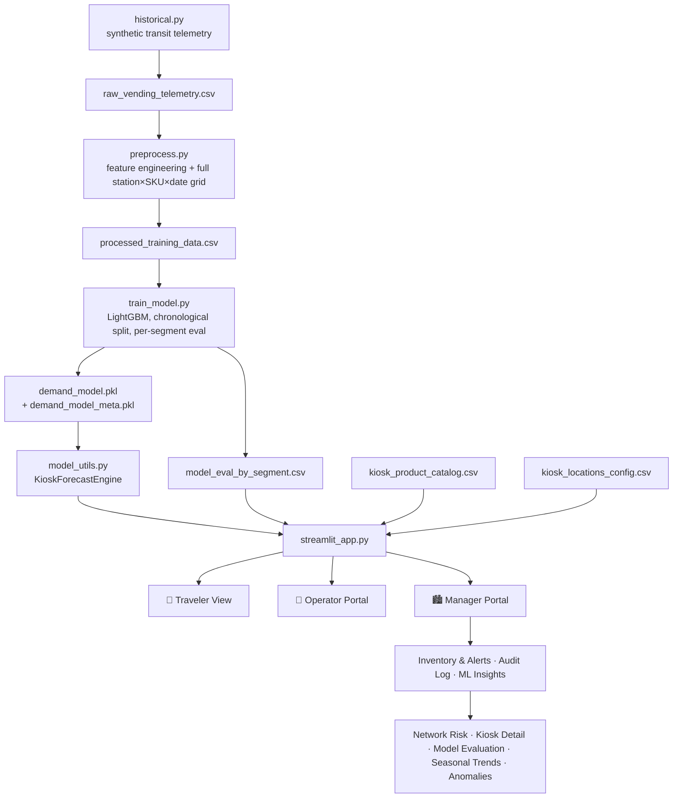

# 🚑 Transit Emergency Medicine Kiosk

**A location-aware, ML-forecasted medicine dispensary network for India's transit hubs, with a full operations stack behind it.**

> Symptom-led kiosk for travelers → PIN-gated restock console for operators → network-wide predictive stockout intelligence for managers.

<p align="center">
  <a href="https://www.youtube.com/watch?v=H00sXRvFeXU">
    
  </a>
  <br>
  <b><a href="https://www.youtube.com/watch?v=H00sXRvFeXU">▶ Watch the full demo on YouTube</a></b>
</p>

**Jump to:** [Problem](#the-problem) · [Solution](#the-solution--three-roles-one-system) · [Walkthrough](#product-walkthrough) · [Forecasting Engine](#why-this-is-more-than-a-crud-app--the-forecasting-engine) · [Architecture](#architecture) · [Getting Started](#getting-started) · [Limitations](#known-limitations--roadmap)

---

## The Problem

Travelers moving through India's transit hubs face acute, *location-specific* health risks: altitude sickness at Leh Airport, heat exhaustion at Jaipur Bus Stand, smog-driven respiratory distress at Delhi NDLS in winter, dehydration at humid coastal metros. Unmanned medicine kiosks exist to catch exactly these moments, but most run on **reactive, manual restocking**: someone notices a shelf is empty, or a traveler discovers it mid-emergency.

That creates two compounding business problems:

1. **Stockouts hit hardest exactly where and when demand peaks.** A hill-station kiosk running out of motion-sickness tablets during tourist season isn't a minor inventory miss. It's the kiosk failing at the one job it exists to do.
2. **No one managing the network can see it coming.** Thirteen kiosks, eleven SKUs, no prioritization, no early warning, just a flat "is it below X units" check that treats a rarely-needed item the same as the one the kiosk was built around.

This project treats kiosk inventory as a **forecasting problem, not just a counting problem**, and builds the operational tooling (three role-based portals) needed to act on that forecast.

---

## The Solution — Three Roles, One System

| Role | Who | What they get |
|---|---|---|
| 🧳 **Traveler** | The public, no login | Climate-aware symptom triage → region-aware product recommendation → cart → mock payment → collect |
| 🔧 **Operator** | Kiosk-level staff, PIN-gated | Single-station view: what's low, how fast it's burning, and a one-click restock with a suggested quantity |
| 🏙️ **Manager** | Network-level, PIN-gated | All 13 kiosks at once: severity-ranked alerts *and* ML-driven stockout forecasting, drill-down by hub, model accuracy transparency, audit trail |

The Operator and Manager views share the same alerting logic at different scope, deliberately: a single-station operator isn't buried in network noise, and a manager isn't restocking one SKU at a time with no macro view.

---

## Product Walkthrough

### 🧳 Traveler: from symptom to dispensed medicine

The kiosk opens on a single call to action, then narrows in two taps: pick your transit hub, then pick your discomfort. The hub banner surfaces that location's primary climate risk (here, *Smog & Respiratory Irritation* at Delhi NDLS), and the recommendations that follow are filtered to what that hub actually needs.

<table>
  <tr>
    <td align="center" width="50%"> 
      
      <br><sub><b>1. Welcome:</b> one-tap start</sub>
    </td>
    <td align="center" width="50%">
      
      <br><sub><b>2. Hub selection:</b> 13 hubs, each tagged with its climate sub-group</sub>
    </td>
  </tr>
  <tr>
    <td align="center" width="50%">
      
      <br><sub><b>3. Symptom selection:</b> the hub's primary risk is surfaced up front</sub>
    </td>
    <td align="center" width="50%">
      
      <br><sub><b>4. Recommendation:</b> region-critical badge, live stock, per-passenger limit</sub>
    </td>
  </tr>
  <tr>
    <td align="center" width="50%">
      
      <br><sub><b>5. Mock payment:</b> simulated secure checkout</sub>
    </td>
    <td align="center" width="50%">
      
      <br><sub><b>6. Collect:</b> confirmation and tray pickup</sub>
    </td>
  </tr>
</table>

### 🔧 Operator: see what's low, restock it, know it worked

Operators log in with a station and PIN and see only their own kiosk. Each low item gets a severity card with its **burn rate** and **estimated time to stockout**, and the restock form pre-fills a suggested quantity (a ~14-day supply at that station's historical average) instead of making the operator guess. After confirming, a banner states exactly what changed and whether the alert cleared.

<table>
  <tr>
    <td align="center" width="33%">
      
      <br><sub><b>PIN-gated login</b> scoped to one station</sub>
    </td>
    <td align="center" width="33%">
      
      <br><sub><b>Severity cards + smart restock suggestion</b></sub>
    </td>
    <td align="center" width="33%">
      
      <br><sub><b>Confirmation:</b> what changed, and whether the alert cleared</sub>
    </td>
  </tr>
</table>

### 🏙️ Manager: the whole network, then the ML layer

The Manager portal opens on a network-wide alert count and a grid of hub tiles. Tap a hub to drill into its alerts. The audit log defaults to real transactions (purchases and restocks) so browsing clicks don't read as sales. The **ML Insights** tab then adds the predictive layer on top of the rule-based alerts.

<table>
  <tr>
    <td align="center" width="50%">
      
      <br><sub><b>Network alerts:</b> one banner, one tile per hub</sub>
    </td>
    <td align="center" width="50%">
      
      <br><sub><b>Audit trail:</b> purchases and restocks, filterable</sub>
    </td>
  </tr>
  <tr>
    <td align="center" width="50%">
      
      <br><sub><b>Network Risk:</b> ML-scored SKU health per kiosk</sub>
    </td>
    <td align="center" width="50%">
      
      <br><sub><b>Kiosk Detail:</b> threshold status vs. ML risk, side by side</sub>
    </td>
  </tr>
  <tr>
    <td align="center" width="50%">
      
      <br><sub><b>7-day forecast:</b> confidence labeled per day</sub>
    </td>
    <td align="center" width="50%">
      
      <br><sub><b>Model Evaluation:</b> held-out RMSE/MAE by station or SKU</sub>
    </td>
  </tr>
  <tr>
    <td align="center" colspan="2">
      
      <br><sub><b>Seasonal Trends:</b> which categories spike, and when to pre-stock</sub>
    </td>
  </tr>
</table>

> **Why the Kiosk Detail view matters.** Look at Leh Airport's `DIG-002` in the fourth manager screenshot: the static rule flags it **CRITICAL** (8 units, under the 15-unit threshold), but the model rates it **HEALTHY** because predicted demand is under one unit a day, roughly 8 days of cover. `AID-001` at the same kiosk is flagged by *both* layers (about 0.9 days left). That contrast is the reason the two alerting layers exist: the rule catches everything that's low, and the forecast tells you which of those are actually urgent.

---

## Why This Is More Than a CRUD App — The Forecasting Engine

The predictive layer is the core engineering investment here, and it's built the way a production forecasting system would be, not a toy demo:

**Feature-engineered time series, not a naive average.**
Daily sales are aggregated into a complete `station × SKU × date` grid (143 pairs × 733 days), with `Sales_Lag_1`, `Sales_Lag_7`, `Sales_Rolling_7`, weekend/festival calendar flags, and month/day-of-week seasonality: the standard feature set for short-horizon retail demand forecasting.

**Chronological train/test split, not a random one.**
The model is evaluated on the *most recent* 20% of days, held out entirely from training. A random row-wise split would let the model "see the future" during training and report misleadingly optimistic accuracy, which is one of the most common ways retail forecasting demos overstate themselves.

**Recursive 7-day forecasting with honest uncertainty labeling.**
The underlying LightGBM model predicts one day ahead. To project further out, each day's prediction is fed back in as the next day's lag feature, a standard autoregressive technique. The UI labels Day 1–2 as *high-confidence* and Day 3–7 as a *directional outlook, not a committed number*, because compounding error is real and pretending otherwise would make the tool less trustworthy, not more impressive.

**Per-segment evaluation, not one aggregate RMSE.**
143 station-SKU pairs span wildly different volume. A single RMSE hides whether the model is excellent on high-traffic hubs and mediocre on quiet ones. The evaluation reports RMSE/MAE by station *and* by SKU, computed on held-out data only. (An in-sample evaluation bug was caught and fixed during development: an earlier version scored rows the model had already trained on, which silently inflates reported accuracy.)

**Train/inference consistency.**
Feature definitions at prediction time must match training exactly. During development, an `Is_Weekend` mismatch (Friday flagged as weekend at inference but not in training) and a differing lag fallback were found and fixed, the kind of silent skew that degrades forecasts without ever raising an error.

**Region-criticality-weighted alerting.**
Not every low-stock SKU carries equal business risk. A motion-sickness tablet at a hill-station kiosk is the *reason the kiosk exists there*, so it alerts earlier (25-unit threshold) than a generic universal item (15-unit threshold). This mirrors real inventory practice (criticality-weighted safety stock / ABC analysis) rather than treating every SKU identically.

**Two alerting layers, by design, not redundancy.**
A fixed-threshold rule is the always-on fallback: instant, model-free, never breaks. The ML-driven "days of stock remaining" (current stock ÷ predicted demand) layers on top rather than replacing it, because a demand-aware system that goes down when the model isn't available is worse than a simple one that always works. The app checks for the trained model at runtime and degrades gracefully if it isn't present.

**Cost-aware architecture.**
The Operator's fast alert view computes time-to-stockout and restock suggestions from a cheap historical burn-rate average, not a live model call. The Manager's ML Insights tab is where the ~150 model inferences (network-wide risk scoring across every kiosk and SKU) actually happen. Keeping the expensive path isolated to where it's needed is a conscious tradeoff.

---

## Architecture



---

## Tech Stack

- **App / UI:** Streamlit
- **ML:** LightGBM (gradient-boosted regression), scikit-learn (evaluation metrics)
- **Data:** pandas, NumPy
- **Visualization:** Plotly, Streamlit native charting
- **Storage (prototype):** CSV catalogs + `st.cache_resource` for in-memory, multi-session-shared inventory and audit log (see [Known Limitations](#known-limitations--roadmap))

---

## Project Structure

```
├── streamlit_app.py           # Main app: Traveler / Operator / Manager views
├── model_utils.py             # KioskForecastEngine: inference, risk scoring, held-out eval
├── train_model.py             # LightGBM training, chronological split, per-segment metrics
├── preprocess.py              # Raw telemetry → feature-engineered training matrix
├── historical.py              # Synthetic transit telemetry generator (seasonality, black-swan
│                               #   surge days, outbreak clusters, IoT glitches; deliberately messy)
├── generate_data.py           # Fallback synthetic sales generator for a fresh app instance
├── app.py                     # Standalone CLI: catalog lookup / symptom-destination matching
│
├── assets/                    # Screenshots used in this README
├── kiosk_product_catalog.csv  # SKU catalog: symptom category, region tag, price, form factor
├── kiosk_locations_config.csv # 13 transit hubs: sub-group, primary climate risk
├── raw_vending_telemetry.csv  # Generated by historical.py
├── processed_training_data.csv# Generated by preprocess.py
├── demand_model.pkl           # Trained LightGBM model
├── demand_model_meta.pkl      # Feature list, categorical levels, train/test split date
└── model_eval_by_segment.csv  # Held-out RMSE/MAE by Station and by SKU
```

---

## Getting Started

```bash
# 1. Install dependencies
pip install streamlit lightgbm scikit-learn pandas numpy plotly joblib

# 2. Generate synthetic transit telemetry
python historical.py

# 3. Build the feature-engineered training matrix
python preprocess.py

# 4. Train the demand model
python train_model.py

# 5. Launch the app
streamlit run streamlit_app.py
```

The app runs at `http://localhost:8501`. If the model files aren't present, it still works: alerts, restocking and the traveler flow are model-free, and the ML tabs show a prompt to train the model first.

### Access

| Role | How to access |
|---|---|
| Traveler | Default view, no login |
| Operator | Sidebar → Operator → select station → PIN `1234` |
| Manager | Sidebar → Manager → PIN `9999` |

> ⚠️ These PINs are **plaintext prototype constants**, intentionally not production auth. See below.

---

## Known Limitations & Roadmap

Being explicit about what this *isn't* is part of the engineering, not an afterthought:

- **Auth:** hardcoded plaintext PINs, meant to demonstrate role separation for a portfolio build. A real deployment needs hashed credentials via a proper identity provider.
- **State:** inventory and audit logs live in server-process memory (`st.cache_resource`). That's fine for a single-instance demo but won't survive a restart or scale across multiple app instances. A real deployment needs a database.
- **Forecast horizon:** the model is trained one-day-ahead; the 7-day view is a recursive extension of it, not a purpose-built multi-horizon model. It is accurate near-term and directional further out, and the UI says so rather than hiding it.
- **Synthetic data:** all sales history is generated (with deliberately injected seasonality, surge events, and IoT-style data glitches) rather than sourced from a live deployment. The pipeline and evaluation methodology are built to the standard real data would demand, but the numbers reported here describe *this dataset*, not a live business outcome.

**Natural next steps:** persistent storage (Postgres/SQLite) in place of in-memory state, a purpose-built multi-horizon forecasting model, real authentication, and ingesting real vending telemetry in place of the simulator.

---

## License

MIT. See `LICENSE`.
